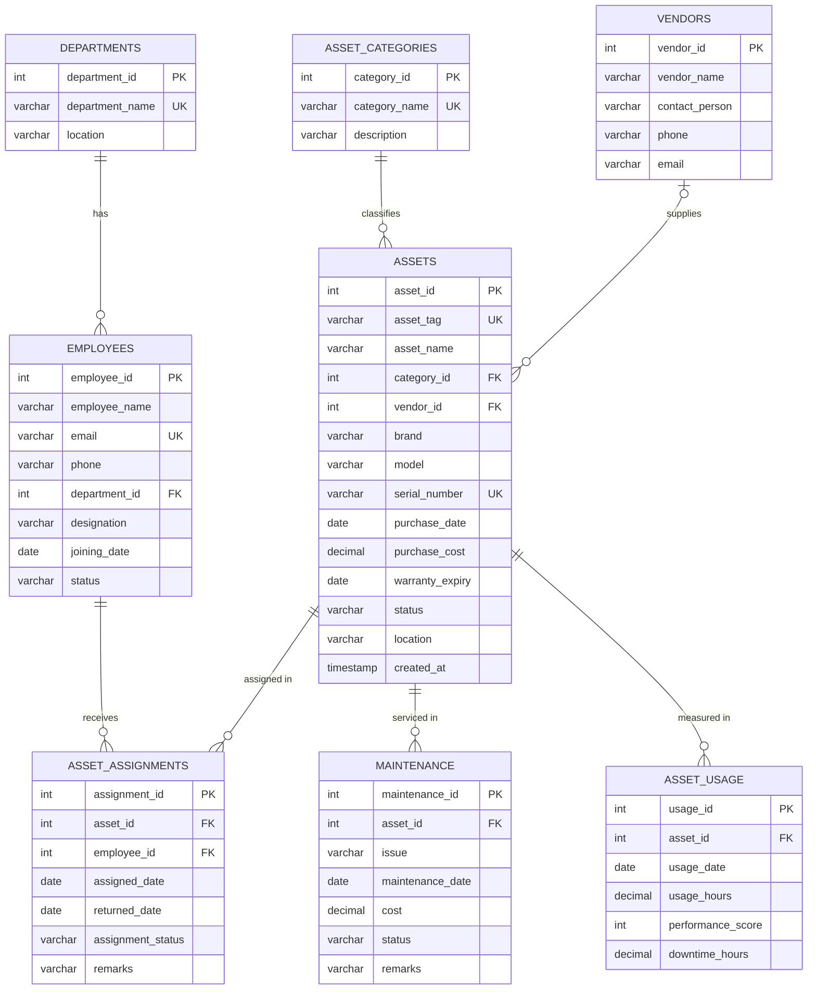

# ER Diagram – IT Assist

Paste the block below into https://mermaid.live (or any Markdown viewer with Mermaid support).

## Relationships (all one-to-many)
| Parent (1) | Child (many) | Foreign key | On delete |
|---|---|---|---|
| departments | employees | employees.department_id | RESTRICT |
| asset_categories | assets | assets.category_id | RESTRICT |
| vendors | assets | assets.vendor_id (optional) | SET NULL |
| employees | asset_assignments | asset_assignments.employee_id | RESTRICT |
| assets | asset_assignments | asset_assignments.asset_id | CASCADE |
| assets | maintenance | maintenance.asset_id | CASCADE |
| assets | asset_usage | asset_usage.asset_id | CASCADE |

`employees` ↔ `assets` is many-to-many over time, resolved by the junction table `asset_assignments`.
